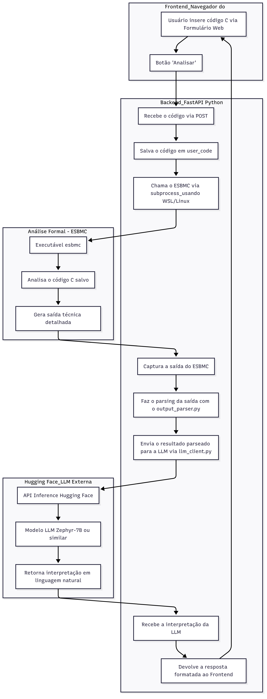

# ESBMC-LLM-C-Analyzer

**Analisador de Segurança de Código C usando Verificação Formal com ESBMC e Inteligência Artificial com LLM (Hugging Face)**

---

## 📌 Descrição do Projeto

Este é um sistema web que permite a análise automática de vulnerabilidades em códigos escritos na linguagem C.  
O projeto integra:

✅ Verificação formal com o **ESBMC (Efficient SMT-Based Bounded Model Checker)**  
✅ Interpretação automática dos resultados com uma **LLM (Large Language Model) da Hugging Face**  
✅ Interface web simples, baseada em **FastAPI** e **HTML/JavaScript**, com efeito de digitação (typewriter effect)

---

## 🚀 Funcionalidades

- ✅ Upload e análise de código C via interface web
- ✅ Execução automática do ESBMC (via WSL ou Linux)
- ✅ Parse e interpretação automática dos resultados do ESBMC
- ✅ Uso de uma LLM para traduzir o resultado técnico em linguagem natural
- ✅ Efeito de digitação na exibição da resposta (experiência tipo ChatGPT)

---

## 🛠️ Tecnologias Utilizadas

- Python 3.10+
- FastAPI
- Uvicorn
- Requests
- dotenv
- ESBMC (instalado separadamente no Linux ou WSL)
- Hugging Face Inference API (modelo sugerido: `HuggingFaceH4/zephyr-7b-beta`)
- HTML + JavaScript (Frontend)

---

## 📂 Estrutura de Pastas

```
secure_c_analyzer/
├── app/
│   ├── main.py
│   ├── esbmc_runner.py
│   ├── output_parser.py
│   └── llm_client.py
├── static/
│   └── style.css
├── user_code/
├── results/
├── requirements.txt
├── .env
├── .gitignore
└── README.md
```

---

## ✅ Como Rodar o Projeto Localmente

### 1. Pré-requisitos

- Python 3.10 ou superior
- Conta na Hugging Face com API Key
- ESBMC instalado em ambiente Linux ou WSL

---

### 2. Instalar as dependências Python:

```bash
pip install -r requirements.txt
```

---

### 3. Configurar a API Key da Hugging Face:

Crie um arquivo `.env` na raiz do projeto com o conteúdo:

```
HUGGINGFACE_API_KEY=YOUR_HUGGINGFACE_API_KEY
```

---

### 4. Configurar o caminho do ESBMC (exemplo):

No arquivo `esbmc_runner.py`, edite a variável `ESBMC_PATH` para apontar para o executável do ESBMC dentro do WSL ou do Linux nativo.

**Exemplo de caminho correto no WSL ou Linux:**

```python
ESBMC_PATH = "/home/seu_usuario/linux-release/bin/esbmc"
```

---

### 5. Rodar o backend FastAPI:

```bash
uvicorn app.main:app --reload
```

---

### 6. Acessar o Frontend Web:

Abra no navegador:

```
http://127.0.0.1:8000/
```

Cole seu código C e clique em **"Analisar Código"**.

---

## 📊 Arquitetura do Sistema



## ⚠️ Importante: Licenciamento e Uso do ESBMC

Este projeto **não contém o código-fonte nem os binários do ESBMC**.

> ✅ O ESBMC é uma ferramenta de verificação formal distribuída sob **Apache 2.0** com partes sob **BSD 4-Clause**, além de utilizar SMT solvers com diversas licenças (MIT, BSD, LGPL, Non-Commercial, etc).

> ✅ **O usuário final é responsável por baixar, instalar e usar o ESBMC de forma separada, seguindo as licenças originais.**

Site oficial do ESBMC:  
[https://github.com/esbmc/esbmc](https://github.com/esbmc/esbmc)

Antes de qualquer redistribuição ou uso comercial, consulte as licenças dos seguintes componentes:

- ESBMC core
- SMT Solvers como Boolector, Z3, MathSAT, etc.

---

## ✅ Possíveis melhorias futuras

- ✅ Suporte a outras linguagens além de C
- ✅ Exportação de relatórios em PDF
- ✅ Histórico de análises
- ✅ Integração com outras LLMs
- ✅ Frontend mais completo com design responsivo
- ✅ Upload de múltiplos arquivos .c

---

## ✅ Licença deste Projeto (Seu código - Python + Frontend)

Este projeto está sob a licença:

```
MIT License
```

---

## ✅ Créditos e Agradecimentos

- ESBMC Team - [https://github.com/esbmc/esbmc](https://github.com/esbmc/esbmc)
- Hugging Face - [https://huggingface.co](https://huggingface.co)
